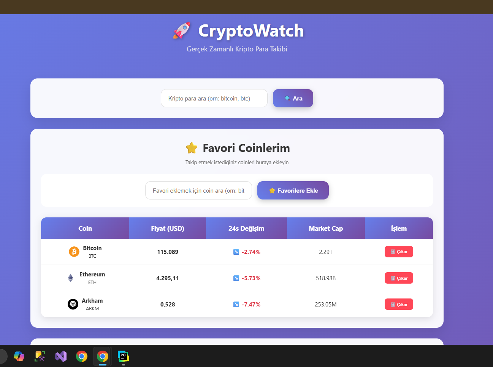
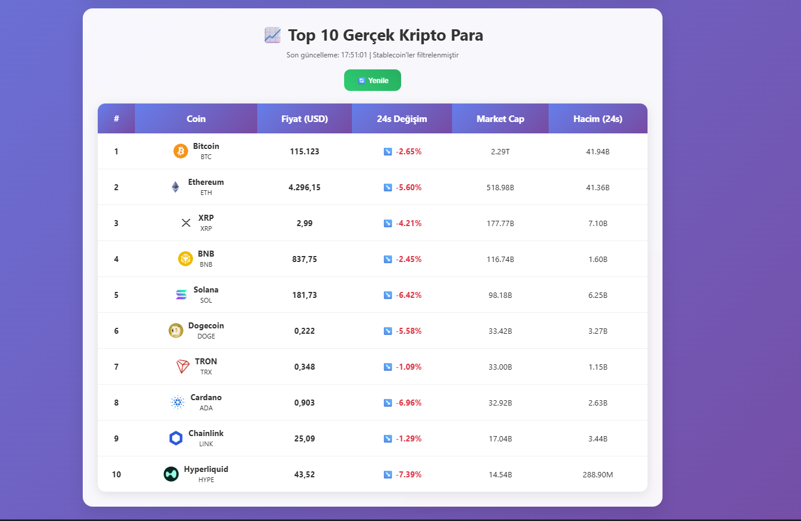
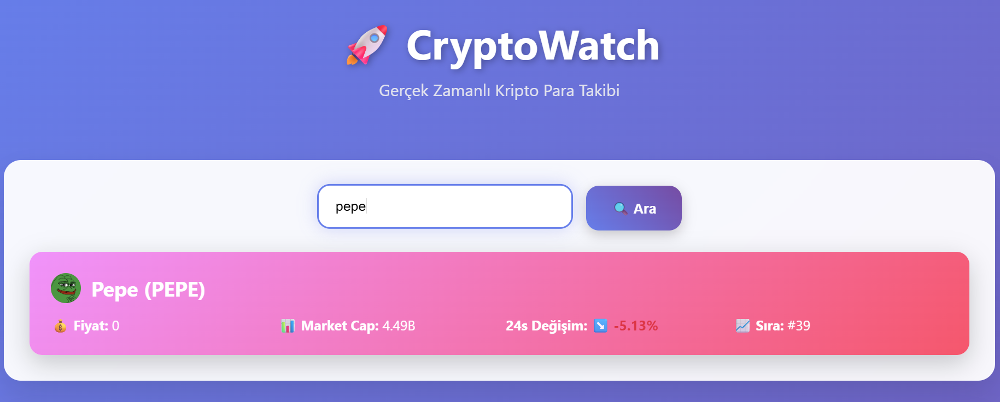

🚀 CryptoWatch

Gerçek zamanlı kripto para takip uygulaması. Kullanıcılar, top 10 gerçek kripto parayı (stablecoin’ler hariç) görebilir, kripto paraları arama yaparak inceleyebilir ve favorilere ekleyip takip edebilir.
 
📌 Özellikler

 Top 10 Kripto Para: Stablecoin’ler hariç piyasa değerine göre ilk 10 gerçek kriptoyu listeler.

 Kripto Arama: CoinGecko API üzerinden kripto adı veya sembolü ile arama yapılabilir (örn: bitcoin, btc).

 Favori Coinler: Kullanıcı istediği coinleri favorilerine ekleyebilir, listeyi kalıcı olarak saklar (localStorage).

 Gerçek Zamanlı Veriler: Fiyat, market cap, 24 saatlik değişim ve işlem hacmi anlık olarak görüntülenir.

 Otomatik Yenileme: Veriler her 2 dakikada bir otomatik güncellenir.

 Modern Arayüz: Responsive tasarım, gradient arka plan, animasyonlu butonlar ve kartlar.

🛠️ Kullanılan Teknolojiler

Backend: Flask (Python)

Frontend: HTML5, CSS3, JavaScript (Vanilla)

API: CoinGecko API

Veri Saklama: LocalStorage (Favoriler için)

 

*****************************************************************************************************************

CryptoWatch/
│
├── app.py               # Flask backend
├── frontend/
│   └── index.html       # Arayüz (template)
├── static/              # İleride CSS/JS ayırmak için
└── README.md            # Proje dokümantasyonu

*****************************************************************************************************************

🚀 Kurulum & Çalıştırma
1️⃣ Ortamı Hazırlama
Python 3.9+ kurulu olmalı.

Gerekli kütüphaneleri yükle:
- pip install flask requests

2️⃣ Uygulamayı Başlat
- python app.py

3️⃣ Tarayıcıda Aç
Flask varsayılan olarak http://127.0.0.1:5000 adresinde çalışır.
Tarayıcıdan şu linke git:
👉 http://localhost:5000
 
*****************************************************************************************************************

